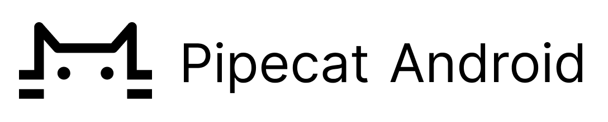

<h1><div align="center">
 
</div></h1>

# Pipecat Android Client SDK

[RTVI](https://github.com/rtvi-ai/) is an open standard for Real-Time Voice (and Video) Inference.

This Android library contains the core components and types needed to set up an RTVI session.

When building an RTVI application, you should use the transport-specific client library (see
[here](https://rtvi.mintlify.app/api-reference/transports/introduction) for available first-party
packages.) The base `PipecatClient` has no transport included.

## Usage

Add the following dependency to your `build.gradle` file:

```
implementation "ai.pipecat:client:1.0.0"
```

Then instantiate the `PipecatClient` from your code:

```kotlin
val callbacks = object : PipecatEventCallbacks() {

    override fun onBackendError(message: String) {
        Log.e(TAG, "Error from backend: $message")
    }
    
    // ...
}

val client = PipecatClient(transport, options)

client.startBotAndConnect(startBotParams).withCallback {
    // ...
}
```

Many `PipecatClient` APIs return a `Future`, which can give callbacks, or be awaited
using Kotlin Coroutines (`client.startBotAndConnect().await()`).
